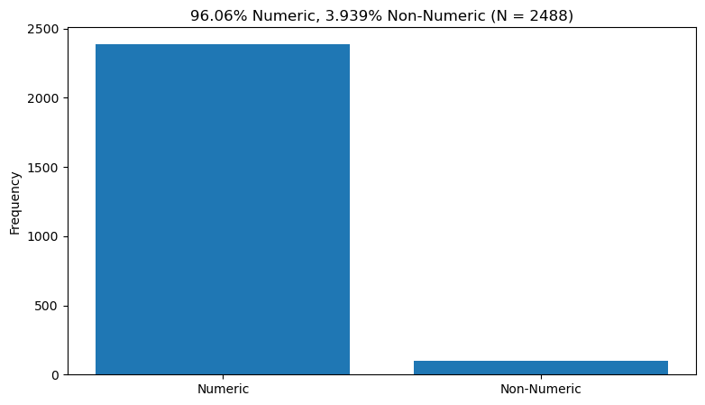
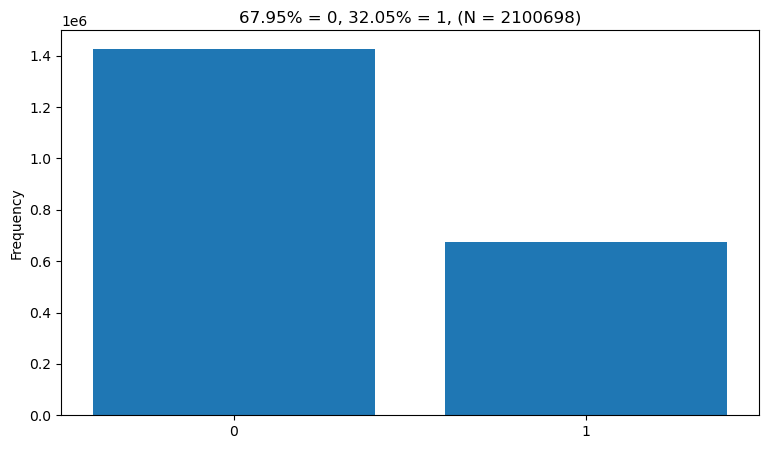

A dictionary of data frame information is available [here](output/dict_df_info.json).

A data frame of descriptive statistics sorted descending by proportion missing by column is available [here](output/df_descriptives.csv).

A data frame of descriptive statistics sorted descending by proportion missing by ID column is available [here](output/df_descriptives_ids.csv).

A plot of percent missing overall in ```df_raw``` is shown below:

<p align="center"></p>

A plot of data type frequency is shown below:
    
<p align="center"></p>

Plots of the targets are shown below:
    
<p align="center"></p>
