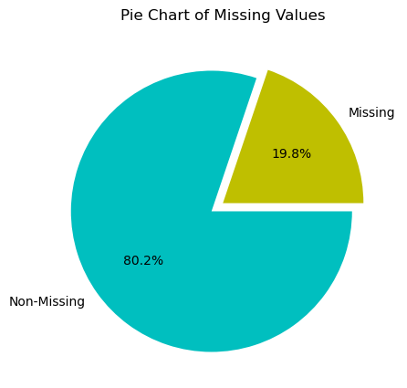
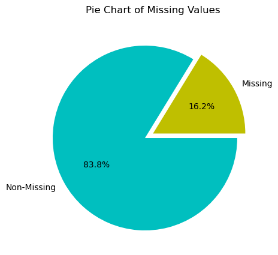
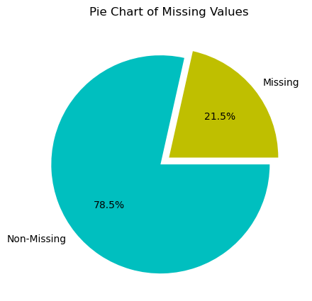
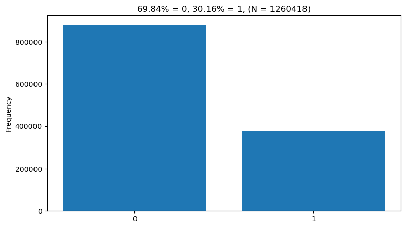
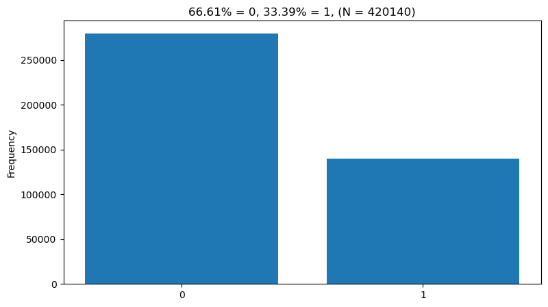
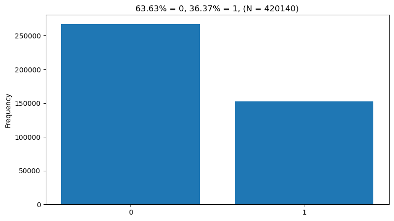

[Data frame information](output/df_info_summary.csv)

---

Descriptives by column:
- [Train](output/df_descriptives_train.csv)
- [Valid](output/df_descriptives_valid.csv)
- [Test](output/df_descriptives_test.csv)

---

Descriptives by ```id``` column:
- [Train](output/df_descriptives_ids_train.csv)
- [Valid](output/df_descriptives_ids_valid.csv)
- [Test](output/df_descriptives_ids_test.csv)

---

Percent ```NaN``` overall (train - left, valid - middle, test - right):

<p float="left">
  
   
  
</p>

---

Data type frequency (train - left, valid - middle, test - right):

<p float="left">
  
   
  
</p>

---

Target (train - left, valid - middle, test - right):

<p float="left">
  
   
  
</p>
