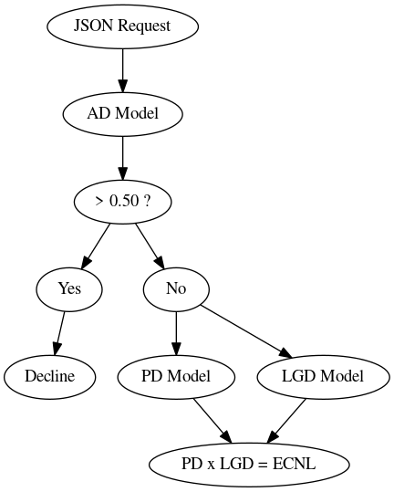
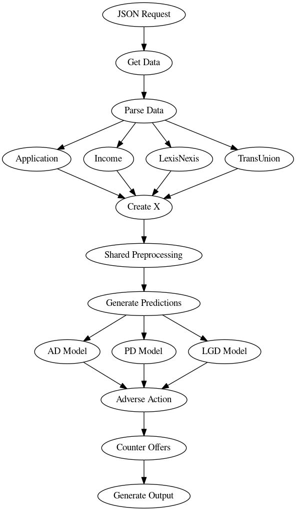
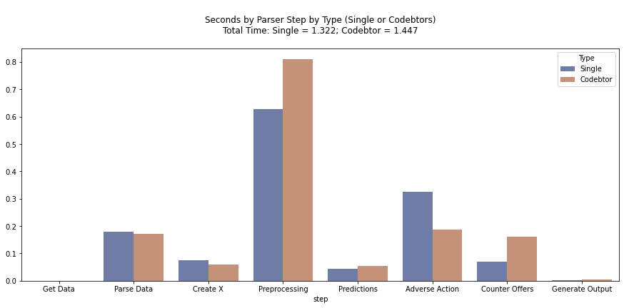

# 20231010_gen_xii

### Important Dates
- 2024-05-07 - noPTImodel10 deployed to dark scoring

### Overview

### Approve/Decline (AD) Model
- [Data prep](https://github.com/PFS-Risk-DS/20231010_gen_xii/tree/main/01_ad/01_data_prep)
- [Summaries](https://github.com/PFS-Risk-DS/20231010_gen_xii/tree/main/01_ad/02_model/03_summary)

### Pricing - Probability of Default (PD) Model
- [Data prep](https://github.com/PFS-Risk-DS/20231010_gen_xii/tree/main/02_pricing_pd/01_data_prep)
- [Summaries](https://github.com/PFS-Risk-DS/20231010_gen_xii/tree/main/02_pricing_pd/02_model/03_summary)

### Pricing - Loss Given Default (LGD) Model
- [Data prep](https://github.com/PFS-Risk-DS/20231010_gen_xii/tree/main/03_pricing_lgd/01_data_prep)
- [Summaries](https://github.com/PFS-Risk-DS/20231010_gen_xii/tree/main/03_pricing_lgd/02_model/03_summary)

### Preprocessing Model
- [Preprocessing Model](https://github.com/PFS-Risk-DS/20231010_gen_xii/blob/main/01_ad/02_model/00_preprocessing/01_create_preprocessor/01_create_image/create_image.ipynb)

### Sample Payloads
- [Single](https://github.com/PFS-Risk-DS/20231010_gen_xii/tree/main/04_sample_payload/01_single/output)
- [Codebtor](https://github.com/PFS-Risk-DS/20231010_gen_xii/tree/main/04_sample_payload/02_codebtor/output)

### Parser

### Parser Analysis

### API Code for Azure
- [API Code](https://github.com/PFS-Risk-DS/20231010_gen_xii/tree/main/07_api/03_for_azure/api)
- [Azure Repository](https://dev.azure.com/PrestigeNerds/Risk/_git/GenXII)

### Writeup
- [Writeup URL](https://mtpeqh7cvu.us-west-2.awsapprunner.com/)

### Payload Comparison
- [App URL](https://rkiixsrmmb.us-west-2.awsapprunner.com/)