# Indirect Lending Model (i.e., Gen 13)

## Contents

- Overview
- Data
- PD Model
- LGD
- Performance
- Identity
- Swap-in swap-out
- Local Dark Scoring
- Compliance
- Simulations
- Early Pay
- Additional Information

---

## Overview

- ECNL = Probability of Default (PD) x Loss Given Default (LGD)
- Where:
	- PD = Probability of going 60+ days past due (DPD) in the first 720 days (24 months) on books
	- LGD = Average charge-off severity by LTV bin (i.e., LTV grid)
		- LTV grid dependent on BK/Non-BK (see LGD section)

---

## Data

- Bad Definition: 60+ DPD in the first 720 days (24 months) on books
- Origin:
	- Payloads stored in snowflake
	- Cost of data set: $0.00
	

---

## PD Model

- [Feature Selection](https://github.com/PFS-Risk-DS/20241112_simple_model_test/blob/main/10_60_in_720_test/02_model/notebook.ipynb)
	- Remove non-numeric features
	- Remove features missing at least 80% of the time in any data set (train, test, holdout)
	- Remove features missing at least 80% of the time in the most recent month of payloads
	- Bin features using OptBinning
	- Remove features with fewer than 2 bins
	- Simple logistic regression models (single variable) to prepare for multicollinearity test
	- Check for multicollinearity
	- Forward stepwise feature selection
	- Remove any features that reduce training AUC via sensitivity analysis (also used for disparate impact analysis)
	- Remove any features that flip direction (contribution vs bad rate by bin)

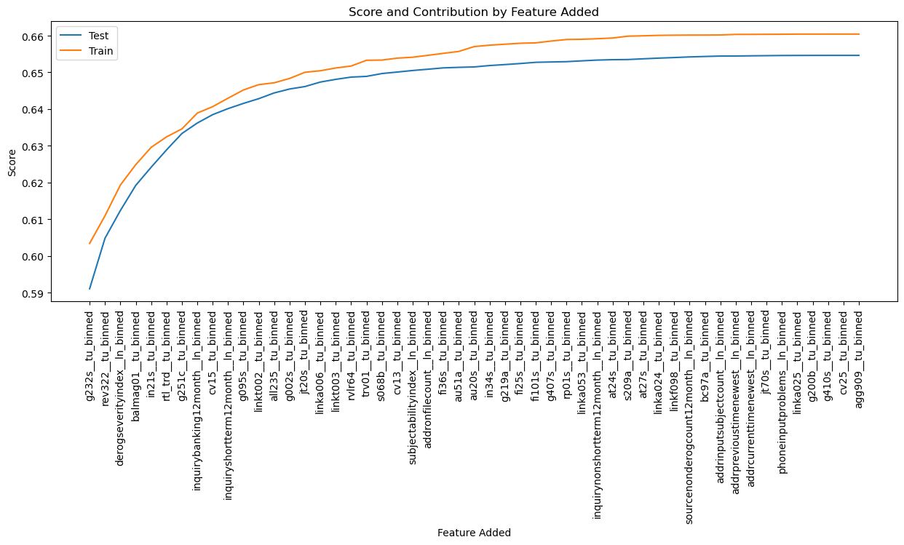

- PD Calculation
	- To manually calculate the PD score:
		- Determine the bin for each feature sand corresponding contribution (bin * coefficient)
		- Sum the contributions (1 per feature) and intercept (this is the "log odds" or "logit")
		- Convert the log odds to a probability

---

## LGD

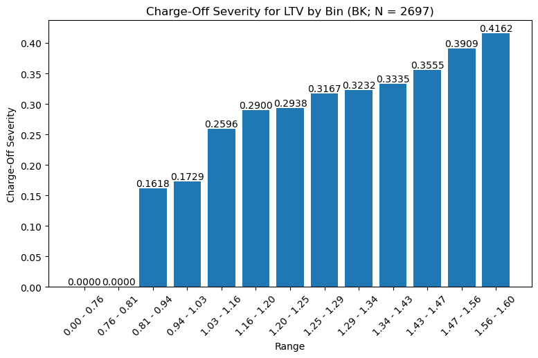
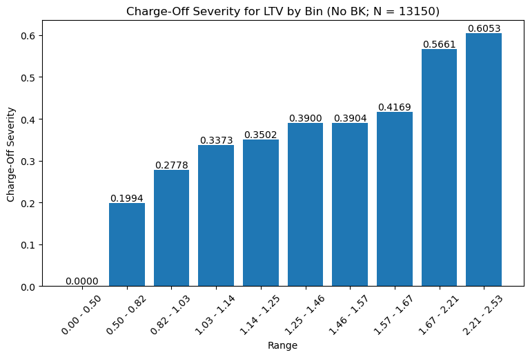

---

## Performance

---

## Identity

BK

Non BK

---

## Swap-in swap-out

---

## Local Dark Scoring

- [Predictions Samples](https://github.com/PFS-Risk-DS/20241112_simple_model_test/blob/main/09_60_in_720/11_show_sample/output)

---

## Compliance

---

## Simulations

---

## Early Pay

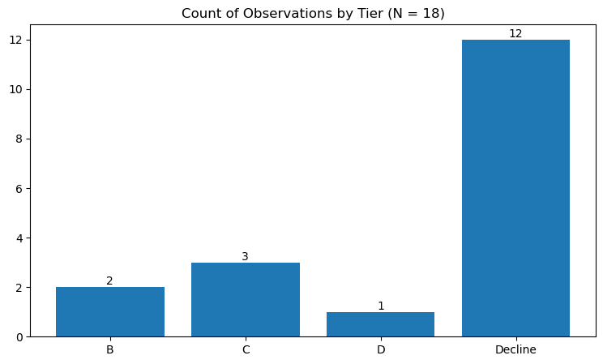

---

## Additional Information

- [Detailed Bins](https://github.com/PFS-Risk-DS/20241112_simple_model_test/blob/main/show_bins/output/df_bins_indirect.csv)

- [Adverse Action](https://github.com/PFS-Risk-DS/20241112_simple_model_test/blob/main/get_aa_dfs/output/df_aa_indirect.csv)

- [Imputations](https://github.com/PFS-Risk-DS/20241112_simple_model_test/blob/main/imputations/output/df_imputations_indirect.csv)

- [EDA](https://github.com/PFS-Risk-DS/20241112_simple_model_test/blob/main/eda/notebook.ipynb)

- [Early Indicator Models](https://github.com/PFS-Risk-DS/20241112_simple_model_test/tree/main/17_fit_early_indicator_models)

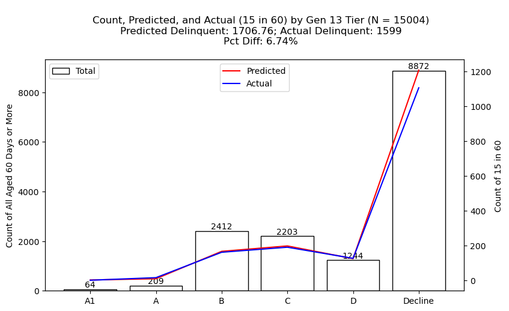
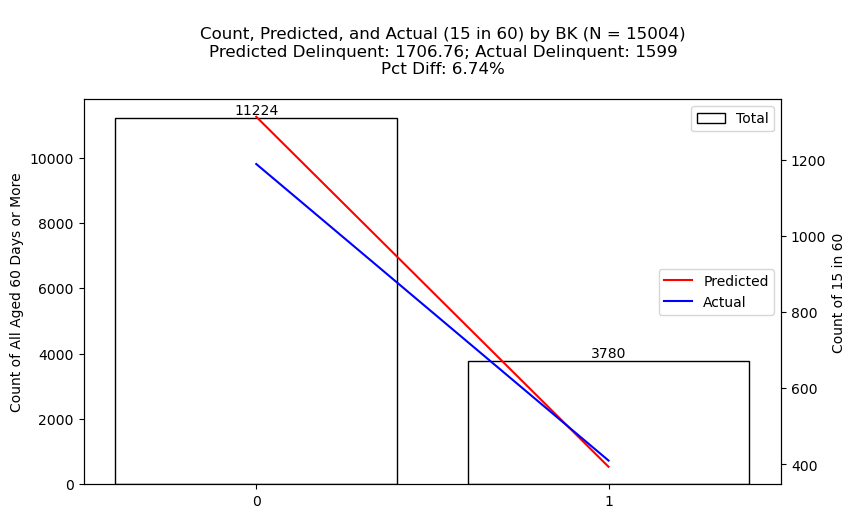
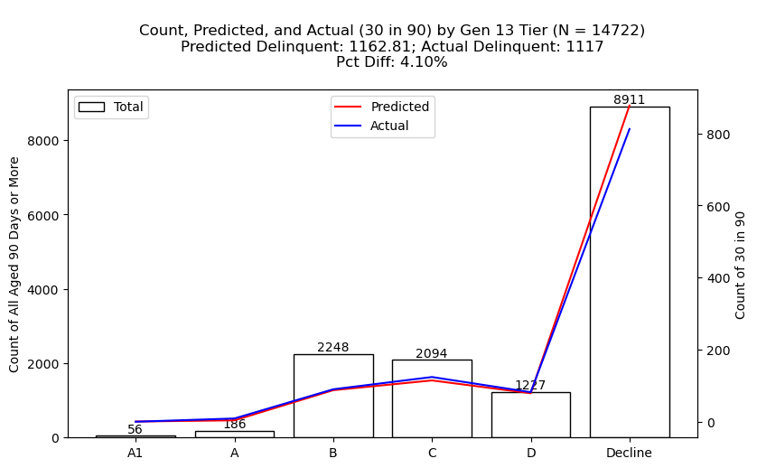
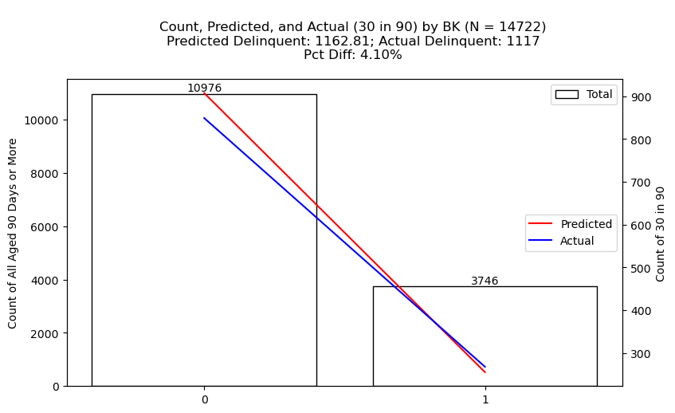
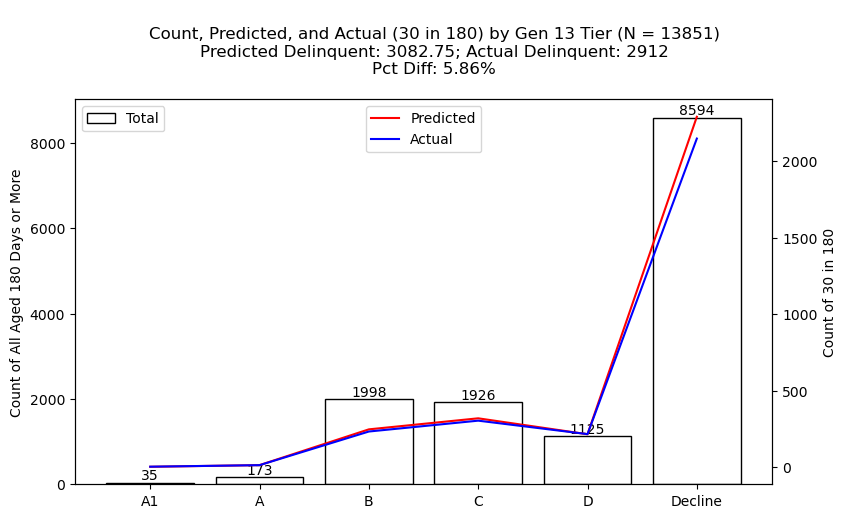

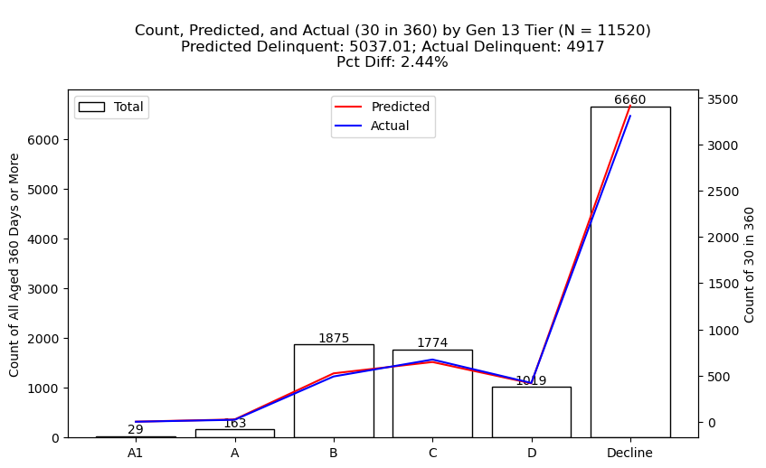
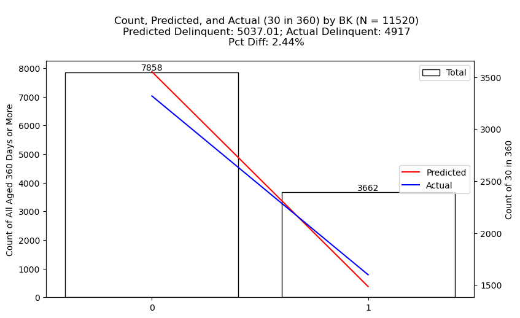

- [Data Dictionary](https://github.com/PFS-Risk-DS/20241112_simple_model_test/blob/main/data_dictionary/data_dictionary.csv)
